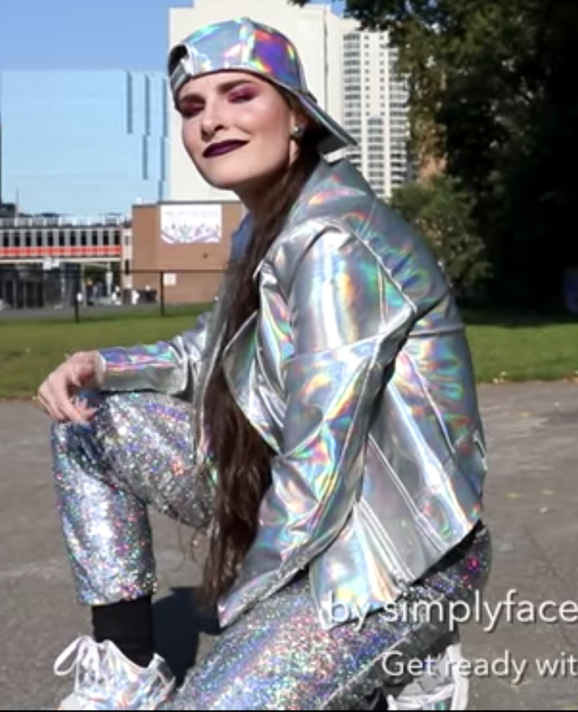

Inspired by Simply Nailogical

HOLO everyone. 
Today we are going to make an image classifier to determine its HOLO or not. 
Let's get cereal!

## Usage
```py
from keras.models import load_model
from PIL import Image
import numpy as np

model = load_model('holo_model.h5')
result_dict = {val:key for (key, val) in train_generator.class_indices.items()}

for i in range(1, 7):
    img = load_img('test/beauty_guru_{}.jpg'.format(i))

    resized_img = img.resize( (150, 150), Image.BILINEAR)
    resized_img = np.reshape(resized_img,[1,150,150,3])
    
    # whaddaya think
    classes = model.predict_classes(resized_img)
    
    result_text = "It's {0}".format(' '.join(result_dict[classes[0][0]].split('_')).upper())
```

### Is it real HOLO ?

`result: REAL HOLO`

`result: FAKE HOLO`